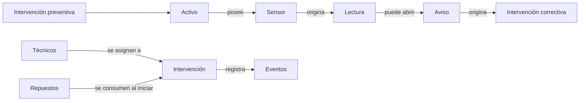
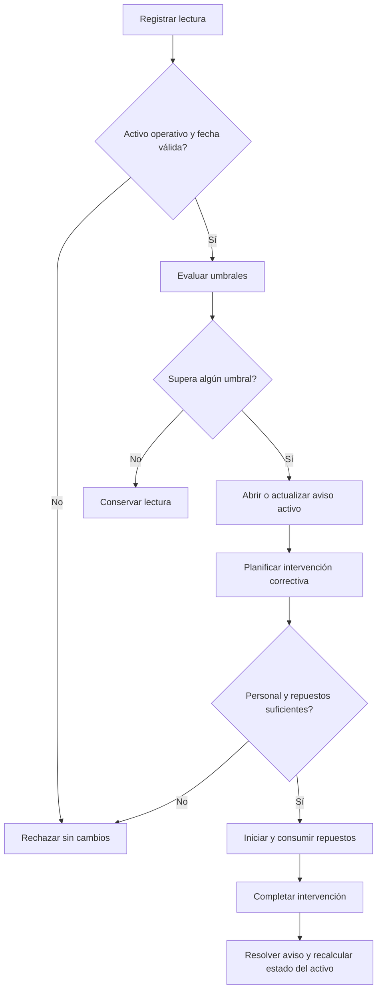

# Trabajo Práctico: Sistema de Mantenimiento de Activos Industriales

## Situación Hipotética

**Industrias Futuro S.A.** opera maquinaria instrumentada en varias plantas. Hoy las lecturas, alertas, repuestos e intervenciones se registran por separado: se duplican avisos por una misma anomalía, se programan tareas sin personal compatible y resulta difícil reconstruir por qué un equipo dejó de operar.

La empresa solicita un prototipo que evalúe lecturas contra umbrales configurados y coordine intervenciones preventivas o correctivas. El sistema detecta condiciones observables; no predice fallas mediante inteligencia artificial ni decide automáticamente el calendario de mantenimiento.

### Objetivo del sistema

El prototipo deberá permitir:

- registrar activos, sensores, técnicos y repuestos;
- procesar lecturas válidas y generar avisos sin duplicarlos;
- planificar intervenciones preventivas y correctivas;
- asignar personal con las especialidades requeridas;
- iniciar y completar intervenciones mediante estados controlados;
- consumir repuestos de manera atómica y mantener un historial auditable.

### Alcance y vocabulario del dominio

| Concepto | Representa | Es responsable de | No es responsable de |
| --- | --- | --- | --- |
| Activo | Una máquina o equipo mantenible | Identidad, especialidades requeridas y estado operativo | Evaluar por sí solo todas las lecturas |
| Sensor | Un dispositivo asociado a un activo | Variable, unidad y umbrales de advertencia y criticidad | Resolver avisos o consumir repuestos |
| Lectura | Una medición ocurrida en un instante | Valor, fecha y sensor de origen | Cambiar el estado del activo directamente |
| Aviso | Una anomalía detectada | Severidad, origen, apertura, estado y resolución | Planificar recursos por sí solo |
| Intervención | Un trabajo preventivo o correctivo | Fechas, requisitos, repuestos y estado | Inventar existencias o especialidades |
| Técnico | Una persona habilitada para intervenir | Identidad y especialidades | Modificar umbrales para ser compatible |
| Repuesto | Un componente consumible | Código y existencia disponible | Conocer en qué intervención se utilizará |
| Evento | Un hecho inmutable del historial | Fecha, tipo, activo y detalle asociado | Reemplazar el estado actual del dominio |

El mapa delimita información del negocio. No prescribe clases, colecciones ni un coordinador único.

### Estados y flujo principal

Un activo puede estar `OPERATIVO`, `EN_MANTENIMIENTO` o `FUERA_DE_SERVICIO`. Un aviso nace `ACTIVO` y puede pasar a `RESUELTO`. Una intervención nace `PLANIFICADA`, pasa a `EN_CURSO` y termina `COMPLETADA` o `CANCELADA`.

### Ejemplo de aceptación

La prensa `P-4` está operativa. Su sensor de vibración tiene umbral de advertencia `7` y crítico `10`. Se registran lecturas `8` a las 09:00 y `12` a las 09:05: queda un único aviso activo para ese sensor, ahora crítico. Se planifica una intervención correctiva que requiere especialidad `mecánica` y dos unidades del repuesto `R-9`; hay una técnica compatible y existencias `3`.

Al iniciarla, el stock de `R-9` queda en `1`, la intervención pasa a `EN_CURSO` y la prensa a `EN_MANTENIMIENTO`. Al completarla, la intervención queda `COMPLETADA`, el aviso se resuelve y la prensa vuelve a `OPERATIVO` si no conserva otros avisos críticos ni intervenciones correctivas pendientes. Si el stock inicial fuera `1`, el inicio se rechazaría sin consumir nada ni cambiar estados.

### Fuera de alcance

No se requiere interfaz gráfica, persistencia, conexión real con sensores, aprendizaje automático, pronósticos estadísticos, compras de repuestos, turnos laborales, costos, múltiples plantas ni planificación automática de fechas.

## Requerimientos Técnicos Obligatorios

- Implementar la solución con Programación Orientada a Objetos y separar el punto de entrada de la lógica del dominio.
- Identificar y justificar una jerarquía de herencia que represente una especialización válida, por ejemplo entre tipos de intervención, y al menos una variación polimórfica real, como la evaluación de distintos tipos de sensor.
- Encapsular estados, inventario y transiciones; no se aceptan cambios directos desde el programa principal.
- Definir excepciones propias para lecturas inválidas, incompatibilidad técnica, falta de repuestos y transiciones ilegales.
- Implementar explícitamente la evaluación de umbrales, la detección de avisos existentes y la revalidación al iniciar.
- Utilizar `datetime` de la biblioteca estándar para instantes y mantener un orden temporal consistente.
- Escribir pruebas unitarias con `pytest` para umbrales, estados, asignaciones, atomicidad y efectos secundarios.

## Reglas de Negocio

1. **Identidad y datos básicos:** Los identificadores de activos, sensores, técnicos, repuestos e intervenciones son únicos dentro de su categoría y no vacíos. Las especialidades, variables y unidades tampoco pueden ser textos vacíos.
2. **Sensores y umbrales:** Cada sensor pertenece a exactamente un activo, mide una variable en una unidad y cumple `umbral_advertencia < umbral_critico`. Ambos umbrales son números finitos.
3. **Lecturas válidas:** Una lectura pertenece a un sensor registrado, tiene valor finito y fecha no anterior a la última lectura aceptada de ese sensor. Solo puede registrarse si el activo está `OPERATIVO`; un rechazo no conserva la lectura ni genera eventos.
4. **Clasificación observable:** Un valor menor o igual que el umbral de advertencia es normal; uno mayor que advertencia y menor o igual que crítico genera severidad `ADVERTENCIA`; uno mayor que crítico genera severidad `CRITICA`.
5. **Aviso único por sensor:** Puede existir como máximo un aviso activo por sensor. Una nueva anomalía sin aviso abre uno; con aviso activo conserva su identidad y eleva su severidad si corresponde, pero nunca la reduce. Una lectura normal no lo resuelve automáticamente.
6. **Estado del activo:** Un aviso crítico activo lleva el activo a `FUERA_DE_SERVICIO`, salvo que ya esté `EN_MANTENIMIENTO`. Un activo solo puede volver a `OPERATIVO` cuando no tiene avisos críticos activos ni intervenciones correctivas planificadas o en curso.
7. **Tipos de intervención:** Una preventiva se programa para un activo y una fecha futura. Una correctiva debe asociarse a un aviso activo del mismo activo; un aviso puede tener como máximo una intervención correctiva no cancelada.
8. **Compatibilidad del personal:** Una intervención declara un conjunto no vacío de especialidades requeridas. Puede iniciarse solo con al menos un técnico asignado y cuando la unión de las especialidades del equipo cubre todos los requisitos.
9. **Repuestos requeridos:** Cada repuesto aparece una sola vez en una intervención con cantidad entera positiva. Al iniciar se revalida todo el inventario; si algún saldo es insuficiente, se rechaza la operación completa sin consumos ni cambios de estado.
10. **Transiciones de intervención:** Solo se permiten `PLANIFICADA -> EN_CURSO -> COMPLETADA` y `PLANIFICADA -> CANCELADA`. Al iniciar, se consumen repuestos y el activo pasa a `EN_MANTENIMIENTO`. Los estados `COMPLETADA` y `CANCELADA` son finales.
11. **Finalización correctiva:** Completar una correctiva resuelve su aviso con la fecha de finalización y recalcula el estado del activo según la regla 6. Completar una preventiva no resuelve avisos. La finalización registra técnicos y cantidades efectivamente utilizadas.
12. **Historial trazable:** Apertura o escalamiento de aviso, cambio a fuera de servicio, inicio, cancelación y finalización de una intervención generan eventos inmutables y cronológicos. Cada evento identifica fecha, activo, tipo y entidades relacionadas; consultar el historial no altera el dominio.

### Pruebas mínimas esperadas

- identificadores duplicados, umbrales inválidos y valores no finitos;
- valores justo en cada umbral y por encima de ellos;
- escalamiento sin duplicar un aviso y lectura normal sin resolución automática;
- rechazo de lecturas por estado o desorden temporal;
- correctiva sin aviso activo o duplicada;
- cobertura de especialidades por uno y por varios técnicos;
- falta de uno entre varios repuestos sin consumo parcial;
- transiciones válidas e inválidas de una intervención;
- finalización preventiva y correctiva con efectos diferentes;
- orden y ausencia de efectos secundarios del historial.

### Decisiones de diseño que deberán resolver

- ¿Quién procesa una lectura y evita duplicar avisos?
- ¿Cómo se representan evaluadores de sensores diferentes sin acumular condicionales?
- ¿El estado operativo se almacena o se deriva? ¿Cómo se preserva su coherencia?
- ¿Qué objeto coordina el consumo atómico de varios repuestos?
- ¿Cómo se verifica que un conjunto de técnicos cubra requisitos compartidos?
- ¿Cómo se registran eventos sin dar al historial permiso para modificar el dominio?

Se evaluarán la coherencia del modelo, la distribución de responsabilidades y la capacidad de justificar el diseño con pruebas, no la coincidencia con un diagrama de clases particular.

### Evolución durante el semestre

1. **Registro operativo:** activos, sensores, lecturas, validaciones y evaluación básica de umbrales.
2. **Gestión de avisos:** severidades, unicidad, escalamiento y estado de los activos.
3. **Intervenciones:** planificación, personal, repuestos, transiciones e historial.
4. **Variación de comportamiento:** al menos dos evaluadores intercambiables, por ejemplo umbral superior y rango permitido, sin modificar el flujo de registro.
5. **Cambio controlado:** la cátedra seleccionará una extensión —por ejemplo reservas de repuestos, mantenimiento por horas de uso o prioridad de intervenciones— para evaluar la evolución del modelo.

Cada incremento conservará las pruebas previas e incluirá una actualización breve del diagrama y de las decisiones afectadas.

## Notas

- Se prohíbe `pandas` y cualquier librería de mantenimiento predictivo; el objetivo es implementar las reglas con estructuras nativas.
- Antes de codificar, presenten un diagrama de responsabilidades y relaciones. Los diagramas de la consigna no fijan la arquitectura.
- Cada decisión deberá estar sustentada y las reglas críticas demostradas mediante pruebas automatizadas.
- Se permite la biblioteca estándar de Python, pero no servicios externos ni modelos entrenados.
